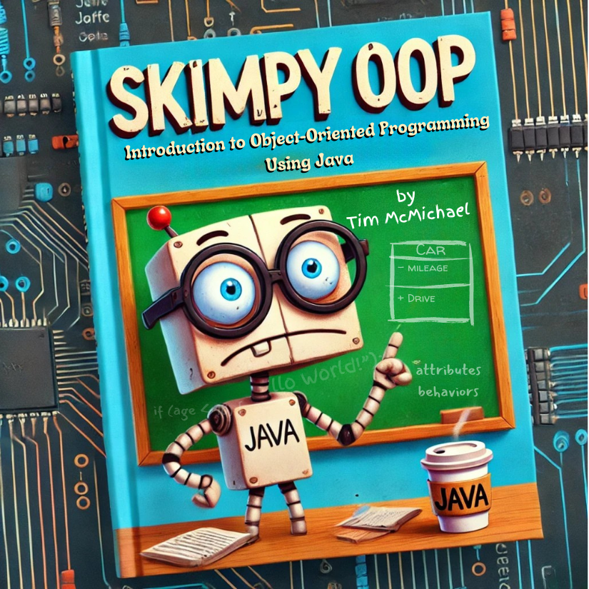
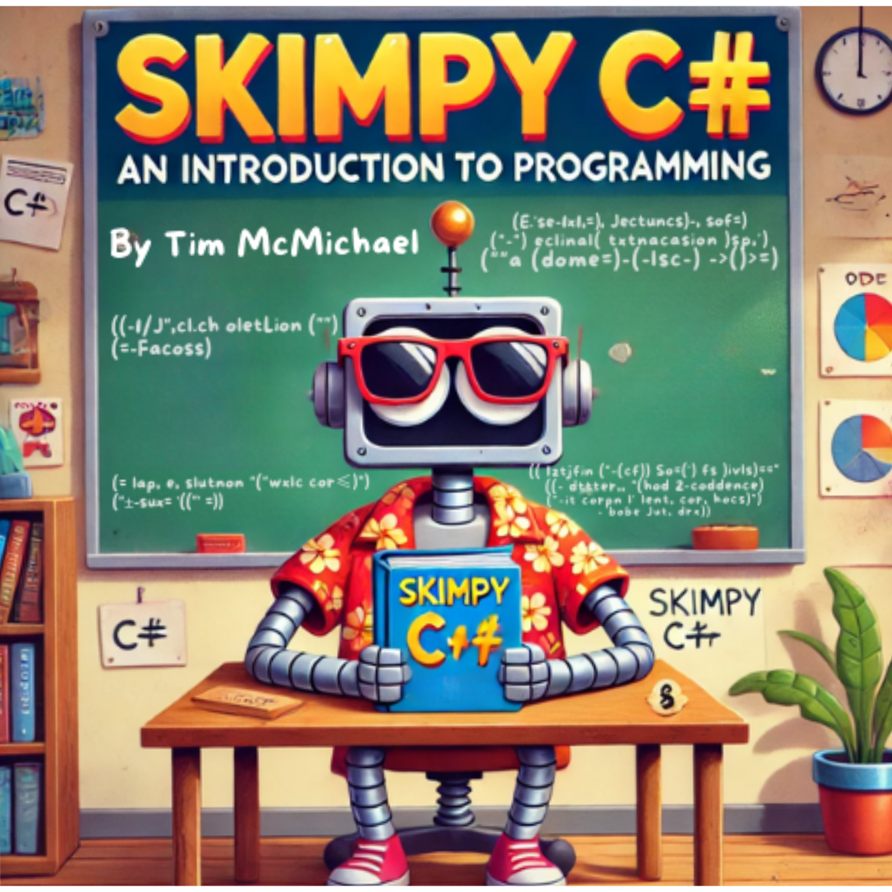

# Tim's Coding Content and Resources

This is a collection of links to various resources resources related to my courses, videos, and written content. 

YouTube Channel: [@ProfTimEMCC](https://www.youtube.com/@ProfTimEMCC)

GitHub Profile: [https://github.com/timmcmichael](https://github.com/timmcmichael)

Source Code Files:
* GitHub: [https://github.com/timmcmichael/EMCCTimFiles](https://github.com/timmcmichael/EMCCTimFiles)

_Note: Files are generally posted in Canvas as well_.

## CIS150AB - Object-Oriented Programming Fundamentals (in Java)

<!--  -->

- eBook: [Skimpy OOP: Introduction to Object-Oriented Programming using Java](http://timmcmichael.github.io/skimpy-oop/)

- Youtube playlist: [Object Oriented Programming Fundamentals](https://www.youtube.com/playlist?list=PL_Lc2HVYD16Y-vLXkIgggjYrSdF5DEFnU)

- [Source files for videos and eBook](https://github.com/timmcmichael/EMCCTimFiles/tree/main/OOP%20with%20Java%20(CIS150AB))

## CIS156 - Python Programming: Level I
- Textbook: zyBooks, see Canvas for information

- Youtube playlist: [CIS156](https://www.youtube.com/playlist?list=PL7yAQImwCColDsNdnMgjxG3VBZHo-Yj2g)

- Source files for videos and eBook: linked in Canvas (for now)

## CIS162AD - C# Programming: Level I

- eBook: [Skimpy C#: An Introduction to Programming](http://timmcmichael.github.io/skimpy-csharp/)

- Youtube playlist: [Introduction to C#](https://www.youtube.com/playlist?list=PL_Lc2HVYD16ZaC1Qy_VcOHCNzT1y8hHJP)

- [Source files for videos](https://github.com/timmcmichael/EMCCTimFiles/tree/main/Intro%20to%20C-Sharp%20(CIS162AD))

## CIS256 - Python: Level II
- Textbook: N/A

- Youtube playlist: [CIS256](https://www.youtube.com/playlist?list=PL7yAQImwCCokO6ntqpfBrKF7GSFmlmaCi)

- Source files for videos: linked in Canvas (for now)

<!-- For -->
